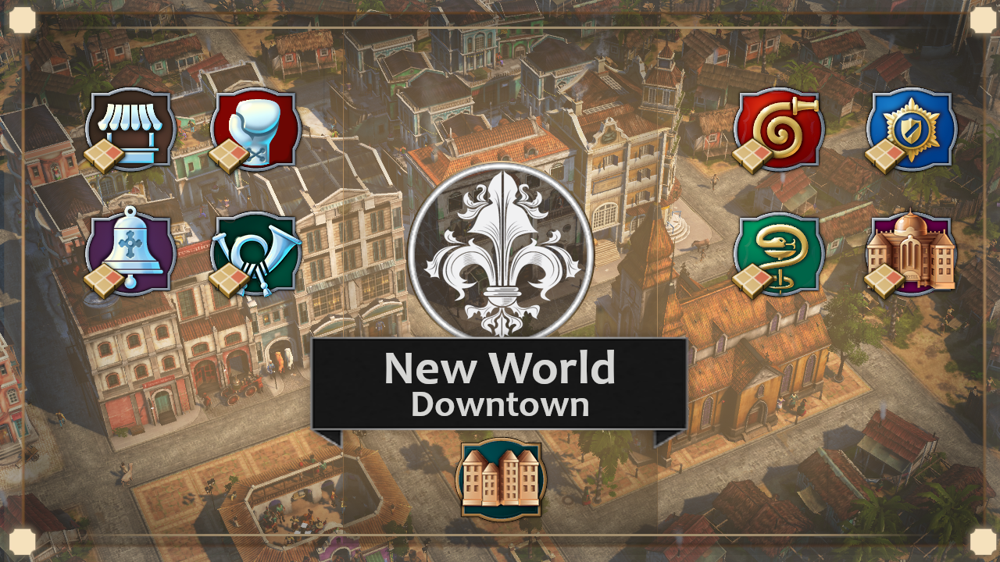

# New World Downtown

- Like the Downtown mod from Lion053, this mod adds 3x3-sized building variations for public services, institutions, post office and hotel in the New World.
- They are intended to be built in a block between residences to form a lively downtown or to cover small (leftover) areas where the larger original would be a waste of precious space.

## Properties

- Public service ranges are lower than their larger originals.
- Institutions have a slightly lower influence distance and you can only mobilize 2 instead of 3 special resolver units.
- The tiny hotel can accomodate 1/3 of the amount of tourists a vanilla hotel can accomodate.
- Construction and maintenance costs reflect their later unlocks
- All other values are inherited from their originals

## Menu

- "Obrero" category, next to Boxing Arena building
- "Public Services" category, next to Boxing Arena building

## Unlock

- The unlock starts at 1.000 obrero for all building types which are originally available at this level.
- For non-dlc owners, the post office and advanced institutions can not be built.
- For non New World Tourism mod owners, the hotel cannot be built.

## Includes

- Market
- Boxing Arena
- Church
- Post Office
- Fire Department with 2 skins
- Advanced Fire Department with 2 skins
- Police Station with 2 skins
- Advanced Police Station with 2 skins
- Hospital with 2 skins
- Advanced Hospital
- Hotel with 4 skins (with New World Tourism Compatibility)

### Possibles future updates

- New skins (for market and boxing arena)
- School (New World School compatibility)
- University
- Bank
- Members Club
- Theatre

## Compatibility

- Should be compatible with all other mods, since it does not alter, replace or remove anything vanilla.

## Credits

Thanks to Lion053's original Downtown mod, which inspired me to port it to this region. 